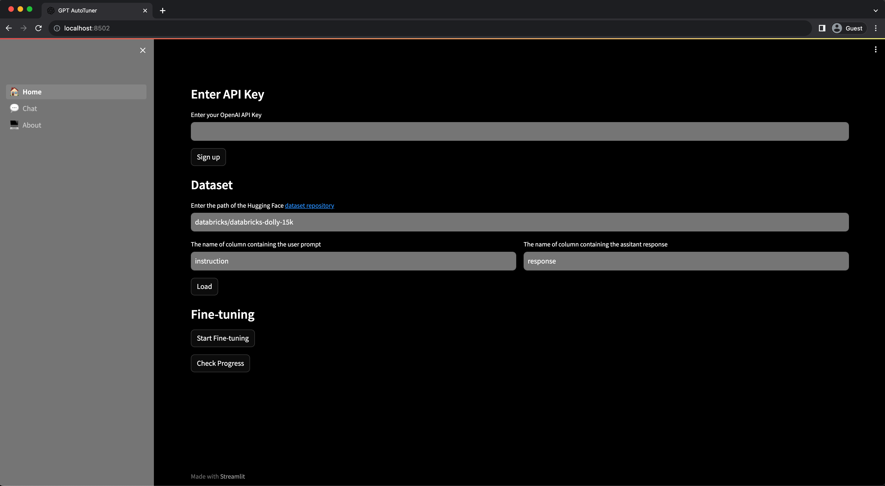

# GPT Auto Tuner
> Fine-tune GPT3.5 and chat with your trained model in a few clicks.

## Get Started
### Install dependencies
`pip install -r requirement.txt`
### Running the Streamlit app
`streamlit run 🏠_Home.py`
### Demo image

## Visit the Free Online App
[autotuner.streamlit.app/](https://autotuner.streamlit.app)

*it may not work 100% of the time due to server limits

